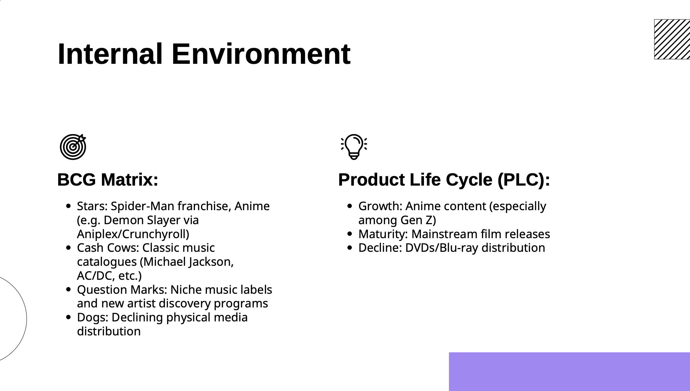
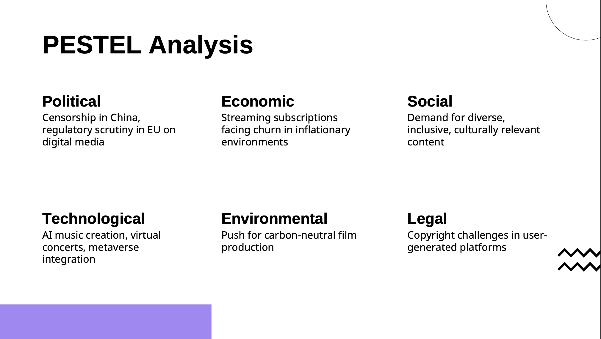

# Sony Pictures & Sony Music – Digital Strategy Analysis

This is the final group project submitted for the **Digital Media & Communication** course at University of Europe, Fall/Spring 2025.

We developed a comprehensive digital strategy and transformation roadmap for **Sony Pictures & Sony Music**, covering:

- Internal & External Environment Analysis
- SWOT, PESTEL & Porter's 5 Forces
- Target Audience Profiling
- Strategic Vision & SMART Objectives
- Proposed Product, Pricing, Distribution, IMC & CRM Tactics
- Platform Implementation Timeline & Budget
- Monitoring & Evaluation Framework

## Project Preview

### BCG Matrix

### PESTEL Analysis

### Gantt Chart (Implementation Timeline)

## Team Roles

- **Mehlika Rana Akbay** – Strategic Tactics & Implementation Plan
- **Roudi Al Asmar** – Situation Analysis (Internal & External)
- **Murad Gurbanli** – Vision, Objectives, Strategic Focus
- **Gamid Mustafaev** – Marketing Mix & Positioning
- **Sasha** – Target Market Analysis
- **Harkaran Singh** – Evaluation & Control

## Final Deliverable

> [Download the Full Project (PDF)](./Sony_Analysis_Presentation.pdf)

## Technologies & Tools

- Slidesgo, Flaticon, Freepik (for visuals)
- Adobe Illustrator, Canva, PowerPoint (for presentation)
- Academic sources (McKinsey, PwC, IBISWorld)

## Key Results

- Defined a unified D2C platform concept: **Sony Stream**
- Created a strategic roadmap for digital engagement with Gen Z
- Developed KPIs and success metrics for launch

---

© 202X Mehlika Rana Akbay & Team.  
Academic project. Not affiliated with Sony.
